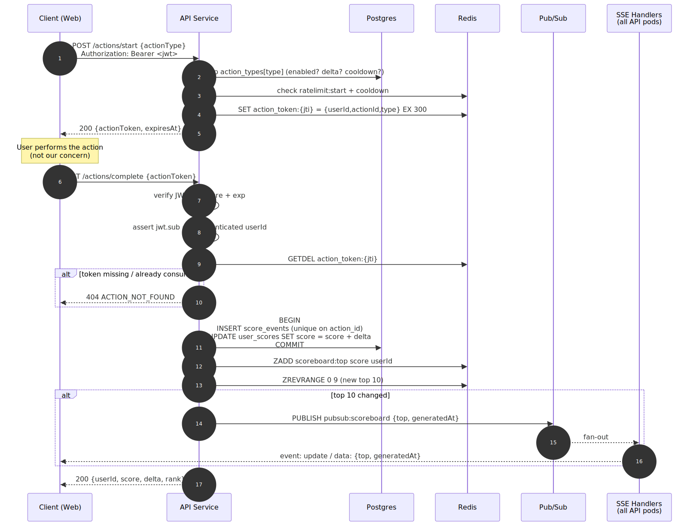
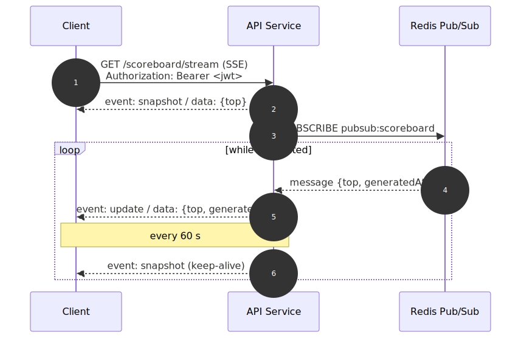

# Problem 6 — Scoreboard Module Specification

Specification for the **Scoreboard** module on the API service.

## 1. Overview

The module is responsible for:

1. Accepting score-increment requests triggered by user actions.
2. Maintaining the top-10 leaderboard.
3. Pushing live updates to clients when the top-10 changes.
4. Preventing unauthorised or fraudulent score increments.

Authentication (issuing a user session / access token) is assumed to already
exist on the API service and is **out of scope** for this module. This module
consumes the authenticated user identity and adds a second, per-action
authorisation layer on top.

## 2. Scope

| In scope                                                         | Out of scope                               |
| ---------------------------------------------------------------- | ------------------------------------------ |
| Score-increment endpoint + per-action authorisation              | User signup / login / password / refresh   |
| Top-10 leaderboard read + cache                                  | What the "action" itself is                |
| Live-update delivery (SSE) + fan-out via Pub/Sub                 | Frontend implementation                    |
| Audit log of every score event                                   | Long-term analytics / reporting            |
| Rate limiting + abuse detection                                  | Admin tooling UI                           |

## 3. Threat model — what "prevent malicious users" means here

Attack we must stop | How
-------------------|----
Direct call to `POST /scores/increment` without doing an action | A score increment must be bound to a signed, **server-minted, single-use action token**; the client never picks the score delta.
Replaying a captured completion request | Each action token is **one-shot** (deleted on first use) and has a short TTL.
One user forging a token for another user | Token payload includes `userId`; server re-checks it matches the authenticated principal on complete.
Spamming start+complete in a loop | Per-user rate limit on both endpoints; action type may carry a server-side cooldown.
Swapping the action type to a higher-scoring one | The delta is resolved **server-side from the stored action record**, not from the client payload.
Horizontal scaling race (two nodes crediting the same token) | Token consumption uses Redis `GETDEL` (atomic) as the source of truth.

Out of scope for this round: behavioural detection, captcha escalation, device
fingerprinting — called out in §11 as future work.

## 4. Data model

### 4.1 Postgres (source of truth)

```sql
-- Existing users table is assumed. Scores live in a dedicated table to keep
-- this module self-contained and to make writes cheap.
CREATE TABLE user_scores (
  user_id     UUID PRIMARY KEY REFERENCES users(id) ON DELETE CASCADE,
  score       BIGINT NOT NULL DEFAULT 0,
  updated_at  TIMESTAMPTZ NOT NULL DEFAULT now()
);
CREATE INDEX user_scores_score_desc ON user_scores (score DESC, user_id);

-- Every applied increment, for audit + replay + anti-abuse forensics.
CREATE TABLE score_events (
  id            UUID PRIMARY KEY DEFAULT gen_random_uuid(),
  user_id       UUID NOT NULL REFERENCES users(id),
  action_id     UUID NOT NULL,      -- the action this increment belongs to
  action_type   TEXT NOT NULL,      -- e.g. "daily_quest", "level_cleared"
  delta         INT NOT NULL,
  created_at    TIMESTAMPTZ NOT NULL DEFAULT now(),
  UNIQUE (action_id)                -- idempotency on action completion
);
CREATE INDEX score_events_user_created ON score_events (user_id, created_at DESC);

-- Server-owned catalog of action types and their score deltas. Operators
-- change this; clients never see the delta column.
CREATE TABLE action_types (
  type       TEXT PRIMARY KEY,
  delta      INT  NOT NULL,
  cooldown_s INT  NOT NULL DEFAULT 0,  -- min seconds between completions per user
  enabled    BOOLEAN NOT NULL DEFAULT true
);
```

### 4.2 Redis (hot path + ephemeral state)

| Key                                          | Type     | TTL       | Purpose                                              |
| -------------------------------------------- | -------- | --------- | ---------------------------------------------------- |
| `scoreboard:top`                             | ZSET     | —         | Mirrors `user_scores` for O(log N) top-10 reads      |
| `action_token:{jti}`                         | STRING   | 5 min     | `{userId, actionId, actionType}` JSON; `GETDEL` to consume |
| `ratelimit:start:{userId}`                   | counter  | sliding   | Per-user rate limit on `POST /actions/start`         |
| `ratelimit:complete:{userId}`                | counter  | sliding   | Per-user rate limit on `POST /actions/complete`      |
| `cooldown:{userId}:{actionType}`             | STRING   | per-type  | Prevents repeating a cooldown-gated action too fast  |
| `pubsub:scoreboard`                          | channel  | —         | Publishes `{topChanged: bool, top: User[]}` on updates |

The ZSET is a cache, not the truth — it is lazily rebuilt from Postgres on
cold start and after any inconsistency is detected.

## 5. API reference

All endpoints require a valid session access token in
`Authorization: Bearer <jwt>`, except the two SSE connects which accept the
same header **or** a short-lived `?token=` query param for browsers that can't
set headers on `EventSource`.

### 5.1 `POST /actions/start`

Client asks the server to authorise the start of an action. Server mints a
single-use action token.

**Request**

```json
{ "actionType": "daily_quest" }
```

**Response `200`**

```json
{
  "actionToken": "eyJhbGciOi…",     // signed JWT, jti = actionId
  "expiresAt": "2026-04-23T12:05:00Z"
}
```

Errors: `400` (unknown or disabled `actionType`), `401` (no session),
`429` (rate-limited), `409` `COOLDOWN_ACTIVE`.

The token encodes `{sub: userId, jti: actionId, typ: actionType, exp}` and is
also written to `action_token:{jti}` in Redis for single-use enforcement.

### 5.2 `POST /actions/complete`

Client reports that an action finished. Server validates the token, consumes
it, applies the pre-configured delta, and returns the new score.

**Request**

```json
{ "actionToken": "eyJhbGciOi…" }
```

**Response `200`**

```json
{
  "userId": "…",
  "score": 42,
  "delta": 10,
  "rank": 7                         // 1-based; null if not in top 10
}
```

Errors: `400 INVALID_TOKEN` (signature, shape), `401` (no session),
`403 TOKEN_USER_MISMATCH` (jwt.sub ≠ authenticated user),
`404 ACTION_NOT_FOUND` (already consumed or expired),
`409 DUPLICATE_COMPLETION` (Postgres `score_events.action_id` unique violation —
defence in depth against a race where two nodes both pass the `GETDEL`),
`429` (rate-limited).

### 5.3 `GET /scoreboard/top`

Returns the current top 10 from the Redis ZSET (falls back to Postgres on
cache miss).

**Response `200`**

```json
{
  "top": [
    { "rank": 1, "userId": "…", "name": "Alice", "score": 9421 },
    …
  ],
  "generatedAt": "2026-04-23T12:00:01Z"
}
```

### 5.4 `GET /scoreboard/stream`  (Server-Sent Events)

Opens an SSE stream that the server uses to push leaderboard snapshots.

- `Content-Type: text/event-stream`
- Event types:
  - `snapshot` — full current top 10, sent on connect and every 60 s keep-alive.
  - `update` — emitted when the top 10 actually changes; payload same shape as `/scoreboard/top`.
- Client should reconnect with exponential backoff; SSE handles this natively.

SSE is recommended over WebSocket here because the traffic is one-way
(server → client), the payload is small, it traverses HTTP middleware
cleanly, and browsers reconnect automatically. WebSocket remains a valid
alternative if bidirectional traffic is added later — see §11.

## 6. Execution flow

Diagrams below are rendered SVGs. Source `.mmd` files live under
[`diagrams/`](diagrams/) — re-render with
`npx @mermaid-js/mermaid-cli mmdc -i diagrams/<name>.mmd -o diagrams/<name>.svg -b transparent`
after editing.

### 6.1 Start → complete (happy path)



### 6.2 Live subscription



### 6.3 Components



## 7. Module layout (recommended)

Follows the project's module-based convention (see Problem 5 for reference
implementation of the pattern).

```
src/modules/scoreboard/
├── scoreboard.routes.ts       # HTTP routes + SSE endpoint
├── scoreboard.controller.ts   # shapes req/res, holds no logic
├── scoreboard.service.ts      # business logic, orchestrates repo + redis
├── scoreboard.repository.ts   # the only place that imports Sequelize models
├── scoreboard.pubsub.ts       # publish + subscribe helpers over Redis
├── scoreboard.tokens.ts       # mint / verify / consume action tokens
├── dto/
│   ├── actions.dto.ts         # Zod: start, complete
│   └── scoreboard.dto.ts      # Zod: query params
└── models/
    ├── user_score.model.ts
    ├── score_event.model.ts
    └── action_type.model.ts
```

Cross-cutting concerns (auth middleware, rate-limit middleware, error handler,
`AppError`) are assumed to already exist at the app level.

## 8. Failure modes

| Failure                                     | Behaviour                                                                                  |
| ------------------------------------------- | ------------------------------------------------------------------------------------------ |
| Redis unavailable during `start`            | 503; reject rather than issue tokens we can't track.                                        |
| Redis unavailable during `complete`         | 503; do **not** apply the increment. Score write and token consumption must be co-decided. |
| Postgres unavailable                        | 503 on mutations; `/scoreboard/top` serves stale ZSET snapshot with `generatedAt`.          |
| Pub/Sub drops a message                     | Acceptable — next mutation publishes a new snapshot. Clients also receive a keep-alive snapshot every 60 s, which self-heals any gap. |
| API pod restart                             | SSE clients reconnect automatically and receive a fresh `snapshot`.                         |
| ZSET drifts from Postgres                   | Background reconciliation job rebuilds `scoreboard:top` from `user_scores ORDER BY score DESC LIMIT 1000` hourly. |
| Two pods race on the same action token      | `GETDEL` makes one win. The loser hits 404. A second line of defence is the unique index on `score_events.action_id`. |

## 9. Observability

- **Metrics** (Prometheus-style):
  - `scoreboard_action_started_total{action_type}`
  - `scoreboard_action_completed_total{action_type, outcome}` — outcome ∈ {applied, invalid_token, expired, duplicate, ratelimited}
  - `scoreboard_top_publish_total` and `scoreboard_sse_connected`
  - `scoreboard_token_latency_seconds` (start → complete gap) histogram — a tight peak at the floor is suspicious (§11).
- **Structured logs**: one log line per completed action with
  `{userId, actionId, actionType, delta, newScore, latencyMs}`.
- **Alerts**:
  - `outcome=invalid_token` rate > N/min → likely tampering.
  - `action_completed` per user > N/min → abusive spam.
  - ZSET/Postgres reconciliation diff > 0 rows → cache corruption.

## 10. Non-functional targets

| Concern              | Target                                                    |
| -------------------- | --------------------------------------------------------- |
| `/actions/complete` p99 | < 100 ms at 1 000 rps steady state                     |
| `/scoreboard/top` p99   | < 20 ms (served from Redis ZSET)                       |
| SSE update latency      | < 500 ms from commit to client                         |
| Max concurrent SSE     | 10 000 per pod; horizontally scalable via Pub/Sub fan-out |

## 11. Improvements (comments for the implementing team)

These are deliberately **not** in scope for v1 but are the obvious next steps:

1. **Behavioural anti-cheat.** Record the elapsed time between `start` and
   `complete`; flag users whose distribution is suspiciously tight or whose
   rate of `complete` events exceeds a physical plausibility bound for the
   action type.
2. **Client-nonce binding.** Have the client send a nonce on `start` and echo
   it on `complete`. Binds the action to the originating browser/device, so
   a leaked token cannot be redeemed from a different client.
3. **Server-sent action parameters.** For actions whose difficulty or reward
   depends on server-computed state (seeded puzzle, RNG roll), include the
   seed / target inside the action token so the server can verify the
   submitted solution on complete.
4. **WebSocket upgrade path.** If we ever need bidirectional traffic (e.g.
   server-driven challenges), the SSE handler can be replaced with a WS
   handler that reuses the same Pub/Sub channel — the protocol contract of
   `snapshot` / `update` events stays the same.
5. **Leaderboard scopes.** Today we ship a single global top-10. A
   `scoreboardId` dimension on the ZSET key (`scoreboard:top:{id}`) makes
   per-season / per-region / per-friends boards trivial without schema
   changes.
6. **Batched publish.** Under burst load, many increments may each trigger a
   publish even when the top-10 doesn't change. Debounce the publish by
   50–100 ms and diff the new top 10 against the previous snapshot.
7. **Replay-proof audit.** Sign each `score_events` row with an append-only
   hash chain so an operator compromise cannot silently edit history.
8. **Delete / soft-delete.** When a user is deleted, `user_scores` cascades,
   but the ZSET must be cleaned by a hook in the user-deletion path.
9. **Admin adjustment endpoint.** A separate, RBAC-guarded
   `POST /scoreboard/adjust` for support staff to correct scores — its writes
   should also flow through `score_events` with a distinct `action_type =
   "admin_adjust"` for auditability.
10. **Cold-start warm-up.** On pod start, pre-populate the ZSET from Postgres
    before accepting traffic, to avoid a thundering-herd `SELECT … ORDER BY
    score DESC` on the first read.

## 12. Open questions for product / ops

- Does "top 10" include ties, or is tie-break deterministic (e.g., earliest
  `updated_at` wins)? — assumed tie-break by earliest `updated_at` here.
- Is the scoreboard global or per-season? — assumed global; §11.5 notes the
  extension path.
- What is the retention policy for `score_events`? — recommend at least
  90 days for abuse forensics.
- Should deleted users remain visible on historical snapshots? — assumed no;
  user deletion cascades.
